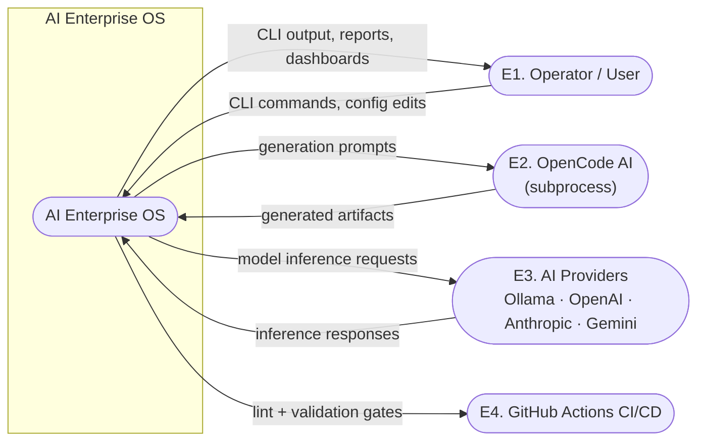
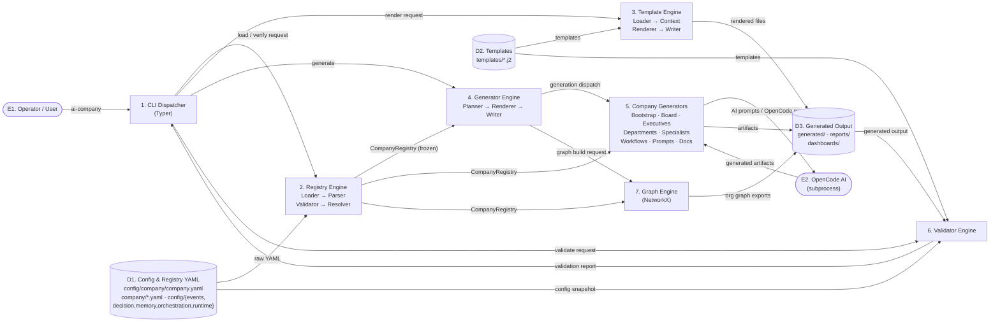
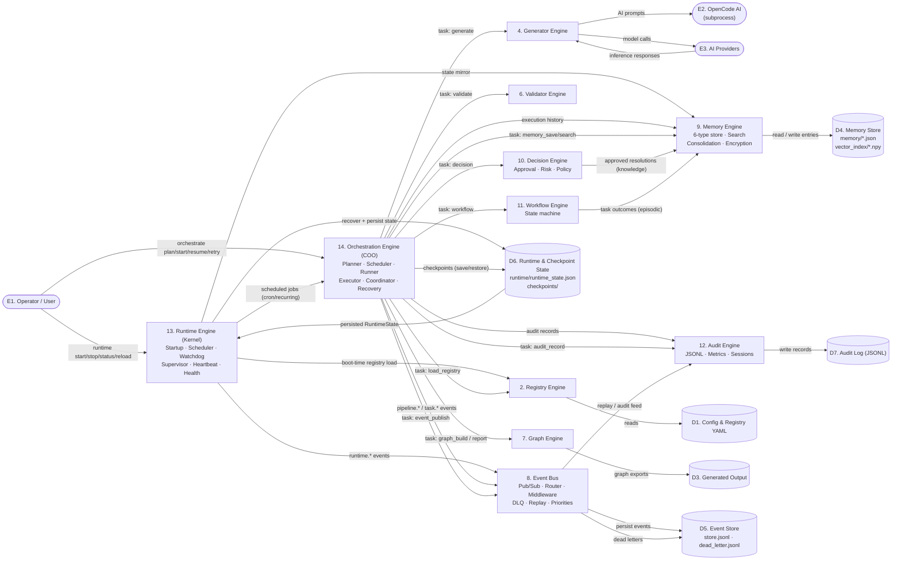
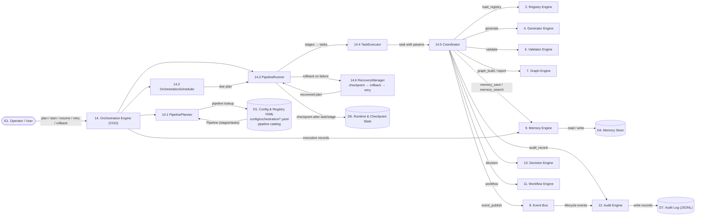

# Data Flow Diagram

Data flow diagrams for the AI Enterprise OS. They describe **what data
moves where**, complementing the component view in
[`docs/architecture-diagram.md`](../docs/architecture-diagram.md).

## Notation

| Shape | Meaning |
|---|---|
| ⬭ Rounded box | **External entity** (source/sink outside the system) |
| ▭ Rectangle | **Process** (numbered; transforms data) |
| ⎘ Cylinder | **Data store** (persistent data at rest) |
| → Solid arrow | **Data flow** (labeled with the data being moved) |
| ⇢ Dashed arrow | Indirect / out-of-process interaction |

## Process & Store Index

| ID | Process | ID | Data store |
|---|---|---|---|
| 1 | CLI Dispatcher (Typer) | D1 | Config & Registry YAML (`config/*.yaml`, `company/*.yaml`) |
| 2 | Registry Engine (Loader → Parser → Validator → Resolver) | D2 | Templates (`templates/*.j2`) |
| 3 | Template Engine (Loader → Context → Renderer → Writer) | D3 | Generated Output (`generated/`, `reports/`, `dashboards/`) |
| 4 | Generator Engine (Planner → Renderer → Writer) | D4 | Memory Store (`memory/*.json`, `vector_index/*.npy`) |
| 5 | Company Generators (bootstrap/board/exec/dept/specialist/workflow/prompts/docs) | D5 | Event Store (`events/store.jsonl`, `dead_letter.jsonl`) |
| 6 | Validator Engine (YAML · Registry · Templates · Manifest · Output) | D6 | Runtime & Checkpoint State (`runtime/`, `checkpoints/`) |
| 7 | Graph Engine (NetworkX) | D7 | Audit Log (JSONL) |
| 8 | Event Bus (Pub/Sub · Router · Middleware · DLQ · Replay) | | |
| 9 | Memory Engine (6-type store · Search · Consolidation · Encryption) | | |
| 10 | Decision Engine (Approval · Risk · Policy · Routing) | | |
| 11 | Workflow Engine (State machine · Transitions) | | |
| 12 | Audit Engine (JSONL · Metrics · Sessions) | | |
| 13 | Runtime Engine — Kernel (Startup · Scheduler · Watchdog · Supervisor · Health) | | |
| 14 | Orchestration Engine — COO (Planner · Scheduler · Runner · Executor · Coordinator · Recovery) | | |

## Context Diagram (Level 0)

The system as a single process with its external entities.

## Level 1 — Build-Time Data Flow

The bootstrap/generation pipeline: configuration is read once, turned into an
immutable `CompanyRegistry`, and consumed by generators that produce artifacts
through templates and OpenCode runs, all guarded by the Validator Engine.

## Level 1 — Runtime Data Flow

The kernel boots the engines, the Event Bus carries lifecycle signals, the
COO layer dispatches tasks to the engines, and every engine persists to its
own store and reports to memory/audit.

## Level 2 — Orchestration Task Execution

Detail of process 14: how a pipeline plan is scheduled, executed task-by-task,
and dispatched to the engines through the Coordinator.

## Key Flows

| # | Flow | Path | Data |
|---|---|---|---|
| F1 | Configuration load | D1 → 2 | Raw YAML → frozen `CompanyRegistry` |
| F2 | Generation | D2 → 3 → D3, 4 → 5 → E2 → D3 | Templates + registry → rendered artifacts |
| F3 | Validation gate | 6 ← (D1, D2, D3) → 1 | Reports gate CLI / CI |
| F4 | Runtime boot | D6 → 13 → (8, 9, 10, 11, 14) | Persisted state + engine initialization |
| F5 | Orchestration | 14 → Coordinator → engines | Pipeline tasks dispatched by `task_type` |
| F6 | Observability | 14/13 → 8 → D5 → 12 → D7 | Events → store → audit log |
| F7 | Memory lifecycle | 9 → D4, 14 → 9 → D6 | Entries, history, checkpoints |

## Sources

- `docs/architecture.md` — subsystem responsibilities
- `docs/architecture-diagram.md` — component diagram
- `docs/PIPELINES.md` — task types, stage modes, built-in pipelines
- `docs/EXECUTION_MODEL.md` — plan → schedule → run → recovery
- `docs/STARTUP_SEQUENCE.md` — runtime boot steps
- `docs/ORCHESTRATION_ENGINE.md` — COO coordinator wiring
- `docs/memory-engine-design.md` — memory taxonomy and persistence
- `config/events/event_pipeline.yaml` — event bus pipeline
