# AI Enterprise OS — System Architecture Diagram

```mermaid
flowchart TB
    subgraph CLI["CLI Layer (Typer) — ai-company"]
        CLI_root["root: bootstrap | build | generate<br/>validate | doctor | targets | status"]
        CLI_company["company (generators)"]
        CLI_exec["exec (executives)"]
        CLI_reg["registry (list | show | verify)"]
        CLI_mem["memory (show | clear)"]
        CLI_graph["graph (show | stats)"]
        CLI_report["report (generate)"]
        CLI_orch["orchestrate (plan | start | status<br/>resume | retry | rollback | history)"]
    end

    subgraph DATA["Data Layer (YAML)"]
        C_MANIFEST["config/company/*.yaml<br/>Manifest + Vision + Strategy<br/>Culture + Governance + Policies<br/>Budget + KPIs"]
        C_TEMPLATES["config/{board,departments,executives,<br/>specialists}/*.yaml — templates"]
        C_WORKFLOWS["config/workflows/*.yaml<br/>workflow definitions + registry"]
        C_EVENTS["config/events/*.yaml<br/>event pipeline + registry"]
        C_DECISION["config/decision/*.yaml<br/>approval matrix + decision tree + risk"]
        C_MEMORY["config/memory/memory.yaml"]
        C_ORCH["config/orchestration/*.yaml<br/>engine + checkpoints + dependencies<br/>recovery + retries + scheduler<br/>monitoring + notifications"]
        C_REGISTRY["company/*.yaml<br/>board + company + departments<br/>executives + policies<br/>specialists + workflows"]
    end

    subgraph ENGINES["Engine Layer"]
        REG["Registry Engine<br/>Loader → Parser → Validator<br/>→ Resolver → CompanyRegistry<br/>(frozen)"]
        TEMPLATE["Template Engine<br/>Jinja2 / Python / Markdown<br/>JSON / YAML handlers"]
        BOOTSTRAP["Bootstrap Generator<br/>Idempotent scaffolding"]
        COMPANY_GEN["Company Generators<br/>Organization · Board · Executives<br/>Departments · Specialists<br/>Workflows · Prompts · Docs<br/>Graph export"]
        GENERATOR["Generator Engine<br/>Planner → Dependency Resolver<br/>→ Renderer → Writer<br/>retry + rollback + checksums"]
        VALIDATOR["Validator Engine<br/>YAML → Registry → Templates<br/>→ Manifest → Output"]
        WORKFLOW["Workflow Engine<br/>Loader + Registry<br/>State machine + Transitions"]
        DECISION["Decision Engine<br/>Approval + Risk + Policy<br/>History + Routing"]
        MEMORY["Memory Engine<br/>Store + Search + Archive<br/>Snapshots + Summaries<br/>Embedding + Knowledge"]
        EVENTBUS["Event Bus<br/>Publish/Subscribe + Router<br/>Dispatcher + Persistence<br/>Dead Letter + Replay<br/>Middleware + Priorities"]
        AUDIT["Audit Engine<br/>JSONL event store<br/>Metrics + Sessions"]
        GRAPH["Graph Engine (NetworkX)<br/>Org charts + Workflow DAGs<br/>Dependency analysis + Export"]
    end

    subgraph COO["Enterprise Orchestration Engine (COO Layer)"]
        ORCH["OrchestrationEngine (facade)"]
        PLANNER["PipelinePlanner"]
        SCHEDULER["OrchestrationScheduler"]
        RUNNER["PipelineRunner"]
        EXECUTOR["TaskExecutor"]
        COORD["Coordinator<br/>(task dispatch → engines)"]
        DURABILITY["State Store + Checkpoints<br/>Rollback + Recovery"]
        OBS["Health + Metrics<br/>Monitoring + Notifications"]
    end

    subgraph PROVIDERS["AI Provider Layer"]
        P_BASE["BaseProvider (ABC) + Factory"]
        P_OPENAI["OpenAI"]
        P_ANTH["Anthropic"]
        P_OLLAMA["Ollama"]
        P_GEMINI["Gemini"]
        P_MOCK["Mock"]
    end

    subgraph EXTERNAL["External Integrations"]
        EXT_OC["OpenCode AI<br/>(subprocess)"]
        EXT_OLLAMA["Ollama (localhost:11434)"]
        EXT_GH["GitHub Actions<br/>CI/CD Pipeline"]
    end

    subgraph OUTPUT["Outputs"]
        OUT_GEN["generated/ (READMEs, docs,<br/>prompts, dashboards, graph)"]
        OUT_REPORTS["reports/ + dashboards/"]
        OUT_MEM["memory/store.jsonl"]
        OUT_EVENTS["events/ store + dead letter"]
        OUT_CI["pre-commit + CI gates"]
    end

    %% CLI → Engines
    CLI_root --> REG
    CLI_root --> BOOTSTRAP
    CLI_root --> VALIDATOR
    CLI_company --> COMPANY_GEN
    CLI_exec --> COMPANY_GEN
    CLI_reg --> REG
    CLI_mem --> MEMORY
    CLI_graph --> GRAPH
    CLI_report --> COMPANY_GEN
    CLI_orch --> ORCH

    %% Data → Engines
    C_REGISTRY --> REG
    C_MANIFEST --> REG
    C_TEMPLATES --> REG
    C_WORKFLOWS --> WORKFLOW
    C_EVENTS --> EVENTBUS
    C_DECISION --> DECISION
    C_MEMORY --> MEMORY
    C_ORCH --> ORCH

    %% Registry feeds all engines
    REG -->|CompanyRegistry| BOOTSTRAP
    REG -->|CompanyRegistry| COMPANY_GEN
    REG -->|CompanyRegistry| GENERATOR
    REG -->|CompanyRegistry| TEMPLATE
    REG -->|CompanyRegistry| VALIDATOR
    REG -->|CompanyRegistry| GRAPH
    REG -->|CompanyRegistry| MEMORY
    REG -->|CompanyRegistry| DECISION
    REG -->|CompanyRegistry| WORKFLOW

    %% Generation pipeline
    BOOTSTRAP --> TEMPLATE
    COMPANY_GEN --> TEMPLATE
    GENERATOR --> TEMPLATE
    GENERATOR --> BOOTSTRAP
    TEMPLATE --> OUT_GEN
    GRAPH --> OUT_GEN
    COMPANY_GEN --> OUT_REPORTS

    %% Validation & quality gates
    VALIDATOR --> REG
    VALIDATOR --> TEMPLATE
    VALIDATOR --> BOOTSTRAP
    VALIDATOR -.-> OUT_CI

    %% COO wiring
    ORCH --> PLANNER
    ORCH --> SCHEDULER
    ORCH --> RUNNER
    ORCH --> OBS
    PLANNER --> SCHEDULER
    SCHEDULER --> RUNNER
    RUNNER --> EXECUTOR
    EXECUTOR --> COORD
    RUNNER --> DURABILITY
    COORD --> REG
    COORD --> GENERATOR
    COORD --> VALIDATOR
    COORD --> WORKFLOW
    COORD --> MEMORY
    COORD --> DECISION
    COORD --> AUDIT
    COORD --> EVENTBUS
    COORD --> GRAPH
    ORCH --> DURABILITY
    OBS --> EVENTBUS

    %% Cross-engine event flow
    EVENTBUS --> AUDIT
    EVENTBUS --> MEMORY
    DECISION --> MEMORY
    AUDIT --> MEMORY
    DECISION --> EVENTBUS
    GRAPH --> EVENTBUS

    %% AI providers
    PROVIDERS --> EXT_OLLAMA
    GENERATOR -.->|AI prompts| EXT_OC
    EXT_OC -.-> EXT_OLLAMA
    COMPANY_GEN -.->|OpenCode run| EXT_OC
    P_BASE --> P_OPENAI
    P_BASE --> P_ANTH
    P_BASE --> P_OLLAMA
    P_BASE --> P_GEMINI
    P_BASE --> P_MOCK

    %% Styling
    classDef completed fill:#1a7a3a,stroke:#2ecc71,stroke-width:2px,color:#fff
    classDef data fill:#1a4a6a,stroke:#3498db,stroke-width:2px,color:#fff

    class CLI_root,CLI_company,CLI_exec,CLI_reg,CLI_mem,CLI_graph,CLI_report,CLI_orch completed
    class REG,TEMPLATE,BOOTSTRAP,COMPANY_GEN,GENERATOR,VALIDATOR,WORKFLOW,DECISION,MEMORY,EVENTBUS,AUDIT,GRAPH completed
    class ORCH,PLANNER,SCHEDULER,RUNNER,EXECUTOR,COORD,DURABILITY,OBS completed
    class P_BASE,P_OPENAI,P_ANTH,P_OLLAMA,P_GEMINI,P_MOCK completed
    class EXT_GH completed
    class OUT_GEN,OUT_REPORTS,OUT_MEM,OUT_EVENTS,OUT_CI completed
    class C_MANIFEST,C_TEMPLATES,C_WORKFLOWS,C_EVENTS,C_DECISION,C_MEMORY,C_ORCH,C_REGISTRY data
```

## Legend

| Color | Meaning |
|---|---|
| 🟢 **Green** | Implemented, tested, and wired to the CLI |
| 🔵 **Blue** | Data/configuration layer (YAML) |
| ⛁ **Dashed arrows** | Indirect / out-of-process interaction (OpenCode subprocess, CI gates) |

## Status by Sprint

| Sprint | Delivered |
|---|---|
| 1–2 | Registry, Template, Bootstrap, Validator engines + CLI |
| 3 | Company generators (board, exec, dept, specialist, workflow, prompts, docs, graph export) |
| 4.4 | Event Bus & Messaging Platform (publish/subscribe, routing, persistence, DLQ, replay) |
| 4.5 | Enterprise Orchestration Engine (COO layer: planning, scheduling, checkpoints, rollback, recovery, health/monitoring) |
