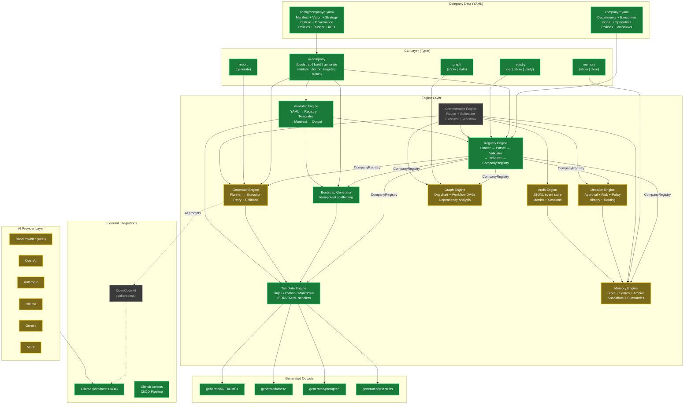

# AI Enterprise OS — System Architecture Diagram

## Legend

| Color | Status |
|---|---|
| 🟢 **Green** (completed) | Production-ready, tested, wired to CLI |
| 🟡 **Yellow** (in progress) | Framework exists, deeper implementation needed |
| ⬛ **Gray** (planned) | Architecture designed, not yet built |
