# AI Enterprise OS — System Architecture Diagram

```mermaid
flowchart TB
    subgraph CC["Command Centers (thin adapters — ADR 0003)"]
        CLI["CLI Layer (Typer) — ai-company<br/>root: bootstrap | build | generate | validate | doctor | targets | status<br/>groups: company | exec | registry | memory | graph | report<br/>orchestrate | runtime | dashboard (token)"]
        API["Dashboard API (FastAPI) — ai-company serve<br/>REST + WebSocket @ 127.0.0.1:8000 (loopback)<br/>~19 read + ~20+ guarded write endpoints<br/>ADR 0002 / 0009 / 0010"]
        OC["OpenCode desktop<br/>session bridge + telemetry-on-close (P1/P2)<br/>deep links ⇄ dashboard (P3/P4)<br/>action telemetry (P5)"]
    end

    subgraph SVC["Shared Services Layer (single surface — ADR 0003)"]
        FACADE["RuntimeFacade<br/>read + write adapters · fail-open envelopes"]
        EVBRIDGE["DashboardEventBridge<br/>EventBus → per-WebSocket asyncio queue"]
        STATUS["StatusService<br/>four-state ok / watch / action / unknown (R12)"]
        GEN["GenerateRunner + GenerateDispatch<br/>opencode primary → ollama fallback (R4)"]
        DLINKS["DeepLinks<br/>opencode://new-session · review_link (P3/P4)"]
    end

    subgraph BUILD["Build-Time Layer (stateless)"]
        REG["Registry Engine<br/>Loader → Parser → Validator → Resolver<br/>→ frozen CompanyRegistry"]
        TEMPLATE["Template Engine (Jinja2)"]
        BOOTSTRAP["Bootstrap Generator<br/>idempotent scaffolding"]
        COMPGEN["Company Generators<br/>org · board · execs · departments<br/>specialists · workflows · docs · graph"]
        GENERATOR["Generator Engine<br/>plan → render → write"]
        VALIDATOR["Validator Engine<br/>5-target gate"]
        GRAPH["Graph Engine (NetworkX)<br/>org charts + DAGs + export"]
    end

    subgraph RT["Run-Time Layer (long-lived kernel)"]
        RUNTIME["RuntimeEngine (facade)<br/>phase machine · state store · config registry"]
        WORKERS["Workers<br/>heartbeat · watchdog · scheduler<br/>supervisor + recovery (ADR 0007)<br/>circuit breaker · process manager"]
        ORCH["OrchestrationEngine (COO)<br/>planner · scheduler · runner · executor<br/>coordinator · checkpoints · rollback"]
        EVBUS["EventBus<br/>pub/sub · router · dispatcher · DLQ · replay"]
        MEM["MemoryEngine<br/>6-type tiered store + search"]
        DEC["DecisionEngine<br/>approval · risk · policy · routing"]
        WF["WorkflowManager<br/>state machines + transitions"]
        AUDIT["Audit<br/>sessions · logger · JSONL"]
        BACKUP["Backup<br/>nightly bundle + restore"]
        PROV["Providers<br/>openai · anthropic · gemini · ollama · mock"]
    end

    subgraph TELE["Telemetry (R5) — JSONL truth → SQLite projection (ADR 0004)"]
        TELE_LOG["runtime/*.jsonl (append-only source of truth)<br/>metrics_history · provider_usage · cli_telemetry<br/>session_telemetry · action_telemetry · alerts<br/>generate_runs · events"]
        READMODEL["ReadModelStore (SQLite WAL)<br/>runtime/dashboard.db · watermark sync<br/>rebuild on startup · single writer"]
        RETENTION["Retention + Rollup<br/>rollup-then-truncate (7/90/180d)"]
        ACTIONS["action_share_summary<br/>D5 share %"]
    end

    subgraph AUTH["Write Auth (ADR 0010)"]
        GUARD["WriteGuard<br/>host policy → bearer → CSRF → audit"]
        TOKENS["WriteTokenService + CsrfService<br/>runtime/.write_token (hash-at-rest)"]
    end

    subgraph DATA["Data Layer (YAML)"]
        C_REGISTRY["company/*.yaml — registry"]
        C_CONFIG["config/**/*.yaml — company · board · departments<br/>executives · specialists · workflows · events<br/>decision · memory · orchestration · runtime"]
        C_PROMPTS["prompts/opencode/*.md — portable Markdown"]
    end

    subgraph EXTERNAL["External Integrations"]
        EXT_OC["OpenCode AI (subprocess / desktop)"]
        EXT_OLLAMA["Ollama (localhost:11434)"]
        EXT_GH["GitHub Actions<br/>CI/CD (ubuntu + windows)"]
    end

    subgraph OUTPUT["Outputs (gitignored)"]
        OUT_GEN["generated/ · reports/ · memory/ · events/"]
        OUT_RUN["runtime/ — state · logs · telemetry · db"]
    end

    %% Command centers → services / engines
    CLI --> FACADE
    CLI --> REG
    CLI --> VALIDATOR
    CLI --> BOOTSTRAP
    API --> FACADE
    API --> GUARD
    OC -.->|HTTP loopback| API
    OC -.->|review submit| FACADE

    %% Services → kernel
    FACADE --> RUNTIME
    FACADE --> GEN
    EVBRIDGE --> EVBUS
    STATUS --> RUNTIME

    %% Build pipeline
    C_CONFIG --> REG
    C_REGISTRY --> REG
    REG -->|frozen CompanyRegistry| BOOTSTRAP
    REG -->|frozen CompanyRegistry| COMPGEN
    REG -->|frozen CompanyRegistry| GENERATOR
    REG -->|frozen CompanyRegistry| TEMPLATE
    REG -->|frozen CompanyRegistry| VALIDATOR
    REG -->|frozen CompanyRegistry| GRAPH
    BOOTSTRAP --> TEMPLATE
    COMPGEN --> TEMPLATE
    GENERATOR --> TEMPLATE
    GENERATOR -.->|AI prompts| EXT_OC
    COMPGEN -.->|OpenCode run| EXT_OC
    TEMPLATE --> OUT_GEN
    VALIDATOR --> REG
    VALIDATOR --> TEMPLATE
    VALIDATOR --> BOOTSTRAP
    GRAPH --> OUT_GEN

    %% Runtime wiring
    RUNTIME --> WORKERS
    RUNTIME --> ORCH
    RUNTIME --> EVBUS
    RUNTIME --> MEM
    RUNTIME --> DEC
    RUNTIME --> WF
    RUNTIME --> READMODEL
    ORCH --> EVBUS
    ORCH --> DEC
    ORCH --> WF
    ORCH --> MEM
    ORCH --> AUDIT
    WORKERS --> EVBUS
    PROV --> EXT_OLLAMA

    %% Telemetry flow
    EVBUS --> TELE_LOG
    AUDIT --> TELE_LOG
    TELE_LOG --> READMODEL
    TELE_LOG --> RETENTION
    RETENTION --> TELE_LOG
    READMODEL --> FACADE
    GUARD --> ACTIONS

    %% Auth
    GUARD --> TOKENS
    GUARD --> AUDIT

    %% Styling
    classDef cc fill:#4a235a,stroke:#9b59b6,stroke-width:2px,color:#fff
    classDef svc fill:#6e2c00,stroke:#e67e22,stroke-width:2px,color:#fff
    classDef completed fill:#1a7a3a,stroke:#2ecc71,stroke-width:2px,color:#fff
    classDef data fill:#1a4a6a,stroke:#3498db,stroke-width:2px,color:#fff
    classDef tele fill:#0e4d45,stroke:#1abc9c,stroke-width:2px,color:#fff
    classDef auth fill:#641e16,stroke:#e74c3c,stroke-width:2px,color:#fff

    class CLI,API,OC cc
    class FACADE,EVBRIDGE,STATUS,GEN,DLINKS svc
    class REG,TEMPLATE,BOOTSTRAP,COMPGEN,GENERATOR,VALIDATOR,GRAPH completed
    class RUNTIME,WORKERS,ORCH,EVBUS,MEM,DEC,WF,AUDIT,BACKUP,PROV completed
    class TELE_LOG,READMODEL,RETENTION,ACTIONS tele
    class GUARD,TOKENS auth
    class EXT_GH completed
    class OUT_GEN,OUT_RUN completed
    class C_REGISTRY,C_CONFIG,C_PROMPTS data
```

## Legend

| Color | Meaning |
|---|---|
| 🟣 **Purple** | Command centers — thin adapters over services (ADR 0003); CLI frozen (ADR 0006) |
| 🟠 **Orange** | Shared services layer — business logic lives exactly once (ADR 0003) |
| 🟢 **Green** | Engines / kernel — implemented, tested, wired |
| 🟦 **Blue** | Data / configuration layer (YAML, Markdown prompts) |
| 🩵 **Teal** | Telemetry — JSONL source of truth + SQLite derived projection (ADR 0004) |
| 🔴 **Red** | Write auth guard (ADR 0010) |
| ⛁ **Dashed arrows** | Indirect / out-of-process interaction (OpenCode subprocess, HTTP to loopback API) |

## Status by Sprint

| Sprint | Delivered |
|---|---|
| 1–2 | Registry, Template, Bootstrap, Validator engines + CLI |
| 3 | Company generators (board, exec, dept, specialist, workflow, prompts, docs, graph export) |
| 4.4 | Event Bus & Messaging Platform (pub/sub, routing, persistence, DLQ, replay) |
| 4.5 | Enterprise Orchestration Engine (COO layer: planning, scheduling, checkpoints, rollback, recovery, health/monitoring) |
| 5.1–5.2 | Dashboard Initiative Phases 1–2: FastAPI command center (ADR 0002/0009), write auth (ADR 0010), services layer (ADR 0003), telemetry workstream (R5), decision inbox, generate runner + dispatch fallback (R4) |
| 5.3 | SQLite derived read model on startup (ADR 0004), agent sync `--scope both`, Windows CI lint/type-check |
| 5.4 | SQLite live telemetry store (watermark sync), retention + rollup, isolation alerting, recovery-success metric, shutdown-order segfault fix |
| 5.5 | Phase 3 command center: session bridge AGENTS.md (P1), session telemetry-on-close (P2), dashboard ⇄ desktop deep links (P3/P4), GUI/desktop action telemetry = honest D5 numerator (P5), R3 parity milestone 44/71 rows (P6) |
