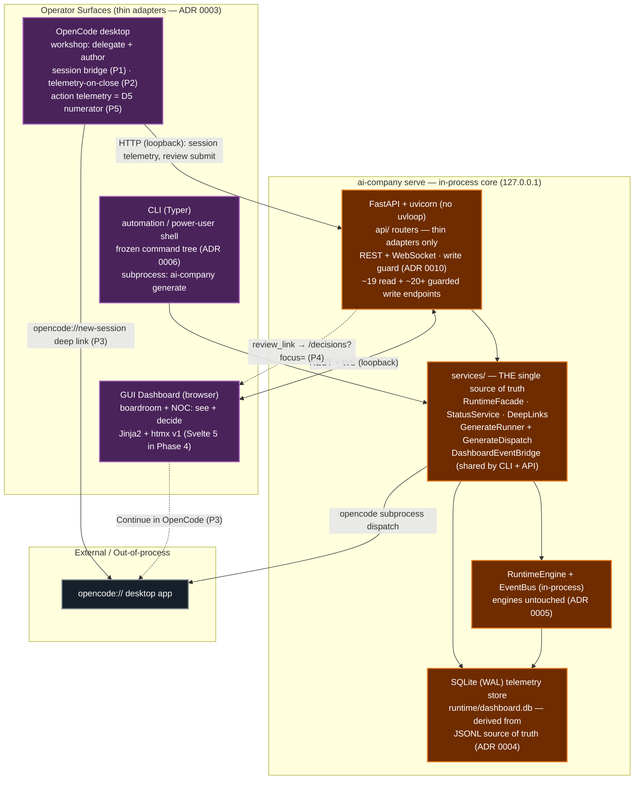

# Dual Command-Center Architecture Diagram

Target operating model (from `docs/dashboard/initiative.md` §1, §3):
**OpenCode desktop = the workshop; Dashboard = the boardroom + NOC;
CLI = the API-compatible shell underneath both.** All three are thin adapters
over the shared `services/` layer (ADR 0003) — business logic lives exactly once.

## Reading guide

| Element | Meaning |
|---|---|
| 🟣 **Surfaces** | The three operator surfaces. CLI is frozen (ADR 0006); every new feature back-ports a CLI command. |
| 🟠 **Core** | The `ai-company serve` process: FastAPI is a transport adapter; all business logic is in `services/` (ADR 0003) over the existing engines (ADR 0005). |
| Solid lines | In-process / HTTP loopback calls between the core and its surfaces. |
| Dashed lines | Deep links / out-of-process desktop dispatch (`opencode://` scheme, HTTP to the loopback API). |

## Anti-drift guarantees

1. **Services layer is the single surface** (ADR 0003) — CLI, API, and desktop
   contain no business logic; parity matrix `docs/dashboard/parity-matrix-v0.md`
   tracks which service each surface exposes.
2. **CLI is frozen** (ADR 0006) — `integrity/check_cli_surface.py` gates
   removal/rename in CI; the command map is an enforced contract.
3. **Engines stay untouched** (ADR 0005) — all new behaviour lands in
   `services/`, never in the kernel.
4. **Write auth** (ADR 0010) — every mutation from any surface flows through
   the shared `WriteGuard` (see `write-auth-flow-diagram.md`).
5. **R3 parity rule** — every new read/write surface ships its golden parity
   test (CLI output == API JSON) in the same change.
