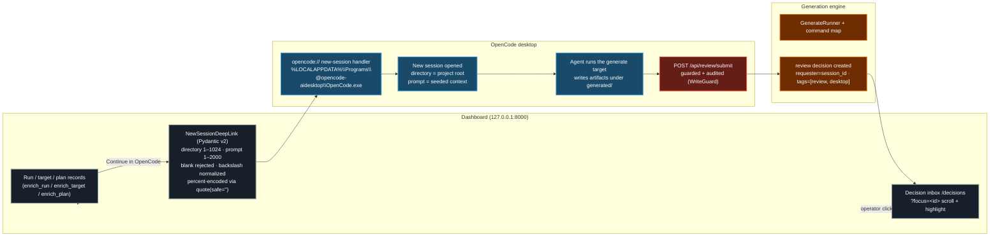

# Deep-Link Map (Dashboard ⇄ OpenCode Desktop)

Phase 3 initiative goal: **≥90% of generation targets runnable desktop-first**
without typing a CLI command. Two deep-link directions (Sprint 5.5 P3/P4):

- **Dashboard → desktop:** run / target / plan records carry a `deep_link`
  (`opencode://new-session?directory=<path>&prompt=<text>`) — one click hands
  the context to a desktop session.
- **Desktop → dashboard:** a desktop agent submits a generated artifact to the
  decision/approval inbox and hands the operator a `review_link`
  (`http://127.0.0.1:8000/decisions?focus=<id>`).

All dashboard→desktop links go through the shared Pydantic v2
`NewSessionDeepLink` model (Core Directive 2) so invalid input is rejected
before it reaches the registry handler. Desktop session-id resume
(`opencode://session/<id>`) is still an upstream feature request
(anomalyco/opencode#6232), so links always open a fresh session seeded with the
selected context.

## Prompt builders

| Surface | Prompt (seeds the desktop session) |
|---|---|
| Run | `run_continue_prompt`: "Continue AI Enterprise OS generation run `{run_id}` for target `{target}` (status: {status})… review artifacts under `{output_dir}` and the log at `{log_path}`…" |
| Target | `target_continue_prompt`: "Continue AI Enterprise OS generate target `{key}`. `{description}` Execute the mapped prompt file `{prompt_file}` (agent: {agent})…" |
| Plan | `plan_continue_prompt`: "Continue AI Enterprise OS orchestration plan `{plan_id}` (status: {status})… drive the plan to completion…" |

## Validation rules (`NewSessionDeepLink`)

| Field | Constraint |
|---|---|
| `directory` | `min_length=1`, `max_length=1024`, non-blank (stripped) |
| `prompt` | `min_length=1`, `max_length=2000`, non-blank (stripped) |
| URL form | `opencode://new-session?directory=<enc>&prompt=<enc>`; backslashes → `/`; both values percent-encoded with `quote(safe='')` |

## Security & parity notes

- **Guarded write:** `POST /api/review/submit` runs under `WriteGuard`
  (`review.submit`, **not** high-impact — no `reason`), records `audit.write`,
  and passes `source="desktop"` to the D5 action counter. Missing CSRF → 403;
  no bearer on non-loopback → 401.
- **Parity N/A:** `opencode://` is a desktop URL scheme, not a CLI surface —
  no `ai-company` counterpart (ADR 0006 frozen CLI). `review_link` is an HTTP
  deep link; both rows are `N/A` in `docs/dashboard/parity-matrix-v0.md`.
- **Failure mode:** enrichment is additive and fail-open — a missing/broken
  `deep_link` never blocks an API response.

## References

- `src/ai_company/services/deep_links.py` — `NewSessionDeepLink`,
  `build_new_session_link`, `enrich_run/target/plan`, `review_link`,
  `project_directory`, `*_continue_prompt`
- `src/ai_company/services/runtime_facade.py` — `generate_targets`,
  `generate_runs`, `generate_run`, `generate_start`, `orchestration_history`,
  `review_submit`
- `src/ai_company/api/operational_endpoints.py` — `POST /api/review/submit`
- `src/ai_company/api/static/app.js` — `focusReview()` + `?focus=` handling
- `docs/dashboard/parity-matrix-v0.md` — P3/P4 deep-link parity rows (N/A)
- `AGENTS.md` — "Submit for review (Sprint 5.5 P4)" one-liner recipe
