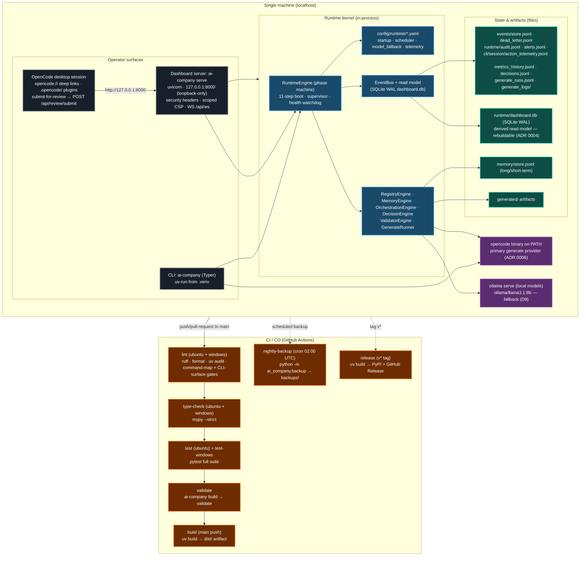

# Deployment Topology

Single-machine deployment. The runtime kernel boots **in-process** on the
dashboard API server (loopback-only, ADR 0002); the CLI is the same wheel; the
OpenCode desktop session is a separate process that talks to the dashboard over
`http://127.0.0.1:8000`. Artifacts are files under the repo root
(`runtime/`, `events/`, `memory/`, `generated/`). CI runs quality gates on
ubuntu + windows (Windows-first project, risk R10).

## What runs where

| Process | Runtime | Bind / surface | Notes |
|---|---|---|---|
| Dashboard API (`ai-company serve`) | `uvicorn` (no uvloop — Windows-safe, ADR 0002) | `127.0.0.1:8000` | Host-guard rejects non-loopback (R9); scoped CSP; WS `/api/ws` |
| Runtime kernel | In-process threads | — | `RuntimeEngine` phase machine; engines + workers run inside the server |
| CLI (`ai-company`) | Typer app | stdio | Frozen surface (ADR 0006); thin adapter over `services/` (ADR 0003) |
| OpenCode desktop | External process | `opencode://` scheme + HTTP loopback | Deep links both directions (P3/P4); session telemetry plugin |
| `ollama` | External process | local | Fallback provider for generate dispatch (R4/D9); optional |
| `opencode` binary | External process | `PATH` | Primary generate provider (frozen CLI contract) |

## Data flow & durability

- JSONL/JSON files are the **source of truth**; `runtime/dashboard.db` is a
  derived, rebuildable SQLite (WAL) projection (ADR 0004) — safe to delete.
- Every write path is append-only and fail-open; read surfaces prefer the read
  model and fall back to JSONL.
- Single-machine by design (`.ai-company/` machine-local, gitignored; no
  distributed agents). CI artifacts are the only cloud-resident copies.

## CI gates (ADR 0006 / R8 / R10)

- **Windows-first:** lint + type-check + full test suite run on both
  `ubuntu-latest` and `windows-latest` (fail-fast disabled).
- **Frozen CLI:** `integrity/check_command_map` and `integrity/check_cli_surface`
  fail on any removal/rename/signature change (additive drift accepted with
  `--update` and committed).
- **Quality bar:** full pytest suite, ruff, mypy `--strict`, format check,
  `uv audit`, lockfile check must all be green before `build` runs on main.

## References

- `.github/workflows/ci.yml` — lint/type-check/test/test-windows/validate/build
- `.github/workflows/nightly-backup.yml` — scheduled backup bundle
- `.github/workflows/release.yml` — tagged PyPI + GitHub Release
- `src/ai_company/api/app.py` — `create_app`, loopback host guard, CSP
- `src/ai_company/runtime/` — `RuntimeEngine`, boot/shutdown, supervisor
- `src/ai_company/services/runtime_facade.py` — shared surface wiring (ADR 0003)
- `pyproject.toml` — Python 3.12-only, `hatchling` wheel, `uv` deps
