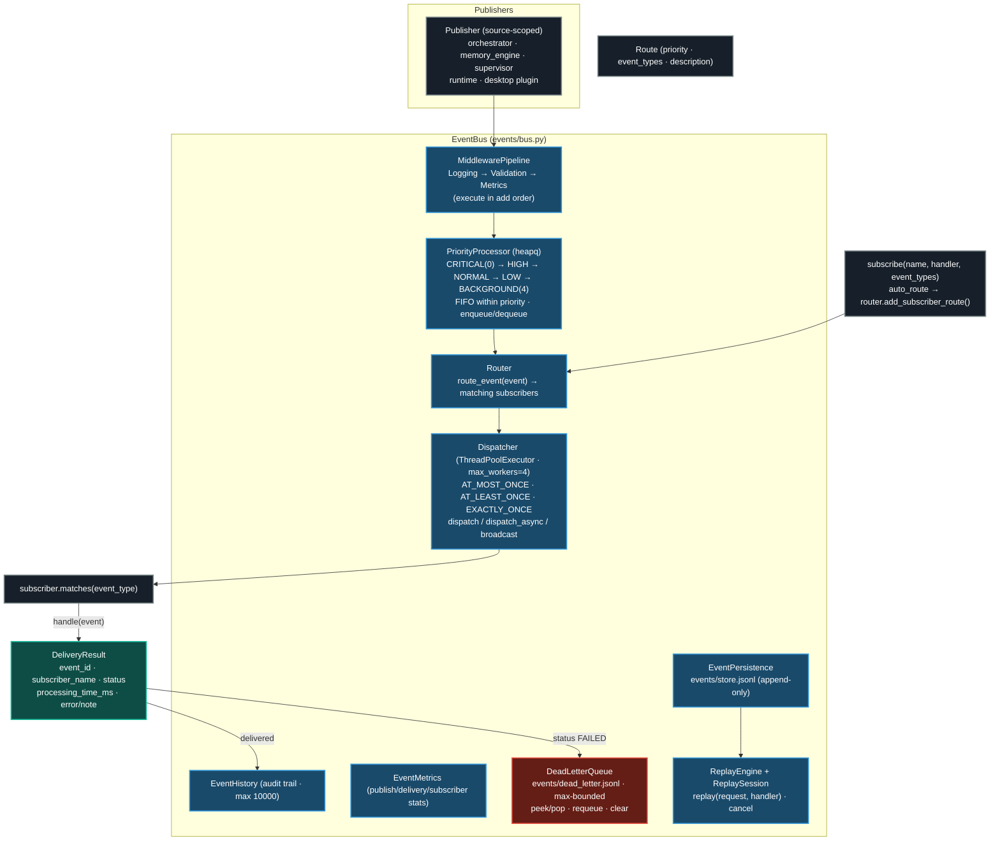

# Event Bus Internals

`EventBus` (`src/ai_company/events/`) is the central hub connecting publishers,
subscribers, routes, dispatchers, persistence, dead-letter queue, replay,
metrics, middleware, and history. An event flows through a fixed pipeline:
**middleware → priority queue → router → dispatcher → persistence → metrics /
history**, with failed deliveries landing in the dead-letter queue.

## Event model (Pydantic v2, `events/models.py`)

| Component | Details |
|---|---|
| `EventType` | `"<domain>.<action>"` past-tense convention — `company.created`, `workflow.started`, `decision.approved`, `memory.saved`, `generation.finished`, `pipeline.recovered`, `system.health_check`, `audit.write`, `runtime.engine_isolated`, etc. |
| `EventPriority` | `CRITICAL` / `HIGH` / `NORMAL` / `LOW` / `BACKGROUND` (ordered) |
| `EventStatus` | `PENDING` / `DELIVERING` / `DELIVERED` / `FAILED` / `SKIPPED` / `RETRYING` / `DEAD_LETTER` / `EXPIRED` / `REPLAYED` |
| `EventMetadata` | `event_id` (`evt_<hex>`), UTC `timestamp`, `priority`, `source`, `correlation_id` |

## Delivery modes

| Mode | Semantics |
|---|---|
| `AT_MOST_ONCE` | Fire-and-forget, no retries |
| `AT_LEAST_ONCE` | Retry on failure until success or max retries (default) |
| `EXACTLY_ONCE` | At-least-once + idempotency (`_processed_ids` dedupe → `SKIPPED` "Already processed") |

## Failure handling

- `Dispatcher._deliver_to_subscriber` wraps the handler in try/except → `FAILED`
  with error text and elapsed time; `metrics.record_failure` + subscriber error.
- `EventBus.publish` sends every `FAILED` result to the **DeadLetterQueue**
  (record: event, subscriber, error, retry_count) and records it in history.
- `requeue_dead_letter(count)` republishes DLQ events back onto the bus.
- `MiddlewarePipeline` executes `Logging → Validation → Metrics` in add order
  (first added = first executed); `RetryMiddleware` (3 retries, exponential
  backoff) is available but not enabled by default.

## Request/reply + replay

- `bus.request(event, timeout)` publishes a request event, temporarily subscribes
  for the `<TYPE>_REPLY` event matched on `correlation_id`, and blocks until
  reply or timeout.
- `bus.replay(ReplayRequest, handler)` replays persisted events — default
  handler republishes them (`_publish_as_replay_handler`); `set_replay_handler`
  overrides; sessions are cancellable.

## References

- `src/ai_company/events/bus.py` — `EventBus` (publish pipeline, lifecycle,
  publishers, subscribe/route, replay, DLQ management)
- `src/ai_company/events/priorities.py` — `PriorityProcessor`, `PrioritizedEvent`
- `src/ai_company/events/dispatcher.py` — `Dispatcher`, delivery modes,
  `_deliver_to_subscriber`
- `src/ai_company/events/middleware.py` — `MiddlewarePipeline` + built-ins
- `src/ai_company/events/models.py` — `EventType`/`EventPriority`/`EventStatus`,
  `EventMetadata`, `Event`, `DeliveryResult`, `ReplayRequest`
- `src/ai_company/events/dead_letter.py` — `DeadLetterQueue`, `DeadLetterRecord`
- `src/ai_company/events/replay.py`, `history.py`, `metrics.py`,
  `persistence.py`, `router.py`, `subscriber.py`
