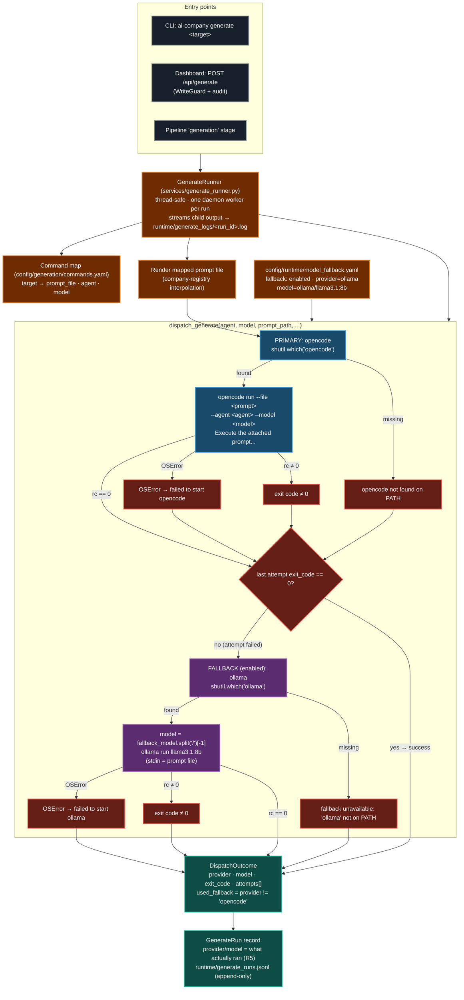

# Generate Dispatch + Local-Model Fallback (R4 / D9)

Every `generate` surface (frozen CLI `ai-company generate <target>`, dashboard
`/generate`, desktop session) funnels through one shared dispatcher:
`services/generate_dispatch.py`. The primary provider is the local `opencode`
binary (the frozen CLI contract, ADR 0006). When OpenCode dispatch fails —
binary missing from PATH, startup failure (`OSError`), or non-zero exit — the
run falls back to a local/free model via the `ollama` CLI (decision D4 default
`ollama/llama3.1:8b`, decision D9) unless fallback is disabled. The outcome
reports **which** provider and model actually ran, keeping run records and
telemetry honest (R5).

## Dispatch decision table

| Primary attempt | Fallback enabled | Fallback present | Result (`DispatchOutcome`) |
|---|---|---|---|
| exit_code 0 | — | — | `provider="opencode"`, success (no fallback attempted) |
| not on PATH | no | — | `provider="opencode"`, `exit_code=None`, error "opencode not found on PATH" |
| not on PATH | yes | yes | `provider="local"`, `model="ollama/llama3.1:8b"` — outcome reports the **fallback** model |
| not on PATH | yes | no | `provider="local"`, `exit_code=None`, error "fallback unavailable: 'ollama' not found on PATH" |
| startup `OSError` | yes | yes | `provider="local"`, fallback ran |
| non-zero exit | yes | yes | `provider="local"`, fallback ran (append-mode log keeps both attempts) |
| non-zero exit (last that ran) | yes | no | `provider="local"`, `exit_code` = last exit code, `used_fallback=True` |

## Failure contracts

- **Cancellation:** `GenerateRunner.cancel()` terminates the live child via
  `register_proc`; run recorded `cancelled`.
- **Restart replay:** runs still `queued`/`running` at boot are replayed from
  history as `failed` with `interrupted by restart` (the worker thread is gone —
  truthful state).
- **Logs:** `_run_process` streams merged stdout+stderr to the run log; a
  fallback run **appends** (never truncates) so the failed primary's output
  stays in the same honest history.
- **Fallback disabled + opencode missing:** fails fast with a descriptive error
  (no thread), mirroring the frozen CLI.

## References

- `src/ai_company/services/generate_dispatch.py` — `FallbackConfig`,
  `DispatchAttempt`, `DispatchOutcome`, `dispatch_generate()`, `_run_process()`
- `src/ai_company/services/generate_runner.py` — `GenerateRunner` run lifecycle,
  history, log streaming, `_execute()`
- `config/runtime/model_fallback.yaml` — fallback `enabled/provider/model`
- `docs/dashboard/initiative.md` — risk R4 `[MITIGATED]`, decision D9
- `src/ai_company/cli/commands/generate.py` — frozen CLI wiring (surface
  unchanged, R8 gate)
