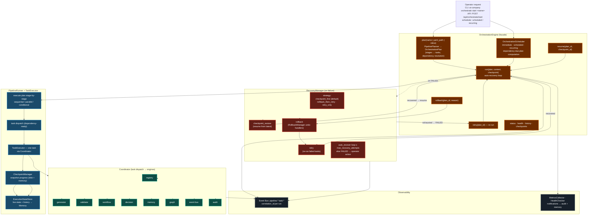
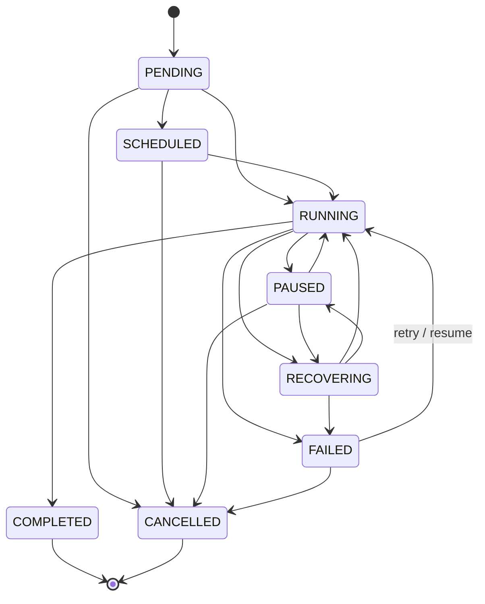
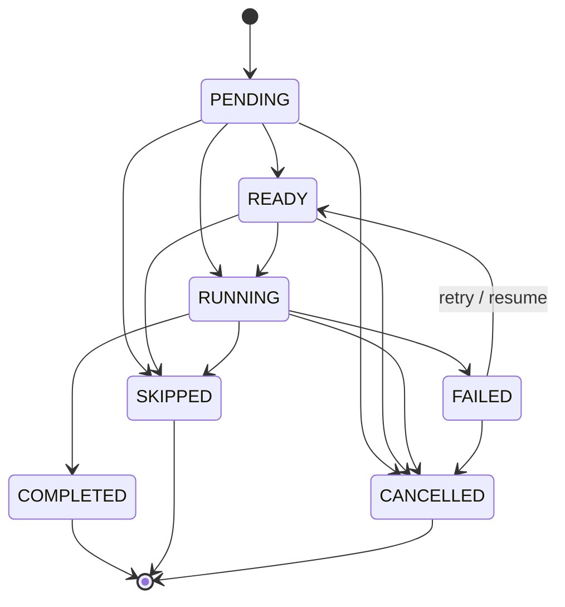

# Orchestration / COO Pipeline Diagram

The Orchestration Engine (`src/ai_company/orchestration/`) is the COO layer:
it plans, schedules, executes, checkpoints, and recovers company pipelines by
**coordinating the existing engines** — it never implements business logic.
Configuration-driven from `config/orchestration/*.yaml`.

## Pipeline state machine

From `src/ai_company/orchestration/lifecycle.py` (`PIPELINE_TRANSITIONS`):

## Task state machine

From `TASK_TRANSITIONS`:

## References

- `docs/ORCHESTRATION_ENGINE.md` — full public API + event catalog
- `docs/RECOVERY.md` — strategies, action sequence, semantics
- `src/ai_company/orchestration/` — engine, coordinator, planner, pipeline,
  executor, scheduler, checkpoint, rollback, recovery, lifecycle
- `config/orchestration/*.yaml` — engine, scheduler, dependencies, retries,
  checkpoints, recovery, monitoring, notifications
