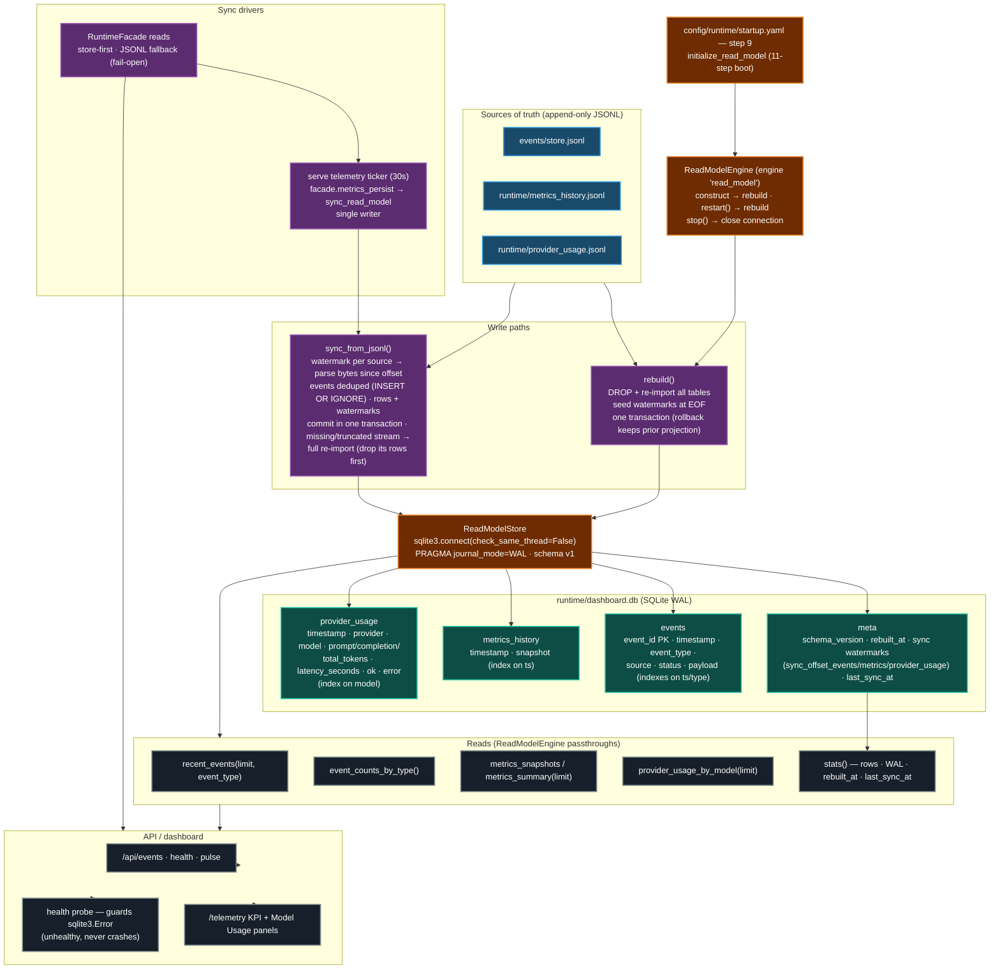

# Read Model Diagram (ADR 0004)

The JSONL/JSON files are the **source of truth**; `runtime/dashboard.db` is a
**derived, rebuildable SQLite (WAL) projection** for dashboard reads. Rebuild
trigger: **on startup** — the `initialize_read_model` boot step constructs
`ReadModelEngine`, which drops and re-imports every table. Live sessions stay
current via the watermark-based incremental sync driven by the telemetry
ticker. Because the projection is derived, any rebuild is safe (no data loss).

## Contract details

| Concern | Behavior |
|---|---|
| **Rebuild trigger** | On startup (`initialize_read_model` boot step) and on `restart()` (supervisor recovery). `stop()` closes the connection. |
| **Incremental sync** | Watermarks stored in `meta` are byte offsets at the last import; appends are whole lines so the tail decodes cleanly. Events deduped by `event_id`; metrics/provider rows carry no natural key so the watermark guarantees exactly-once import. Rows + watermarks commit in **one transaction** — a crash mid-sync rolls back both (no duplicates). |
| **Truncation/rotation** | A source that is missing, truncated, or never synced triggers a full re-import of that stream (its projection rows are dropped first) — the store always mirrors its source. |
| **WAL mode** | Concurrent dashboard reads while the runtime keeps appending JSONL. |
| **Connection threading** | `check_same_thread=False` — rebuilt on the startup thread, probed from supervisor/health threads, queried from FastAPI worker threads. |
| **Fail-open reads** | `RuntimeFacade` prefers the store but falls back to the JSONL sources when the engine is absent or the store read fails (`persistence_enabled` preserved in the envelope). |
| **Health** | `ReadModelEngine.health()` wraps `store.stats()` in `try/except sqlite3.Error` → `{"status": "unhealthy", "error": "store unavailable: ..."}` (Sprint 5.4 T5 defense-in-depth). |
| **Rebuild safety** | All DDL + inserts run inside one transaction; a failed import rolls back, leaving the previous projection intact. |

## References

- `docs/adr/0004-sqlite-derived-read-model.md` — decision + consequences
- `src/ai_company/readmodel/store.py` — `ReadModelStore`, `_SCHEMA_SQL`,
  `rebuild()`, `sync_from_jsonl()`
- `src/ai_company/readmodel/engine.py` — `ReadModelEngine` + read passthroughs
- `config/runtime/startup.yaml` — step 9 `initialize_read_model`
- `docs/STARTUP_SEQUENCE.md` — boot step tables
