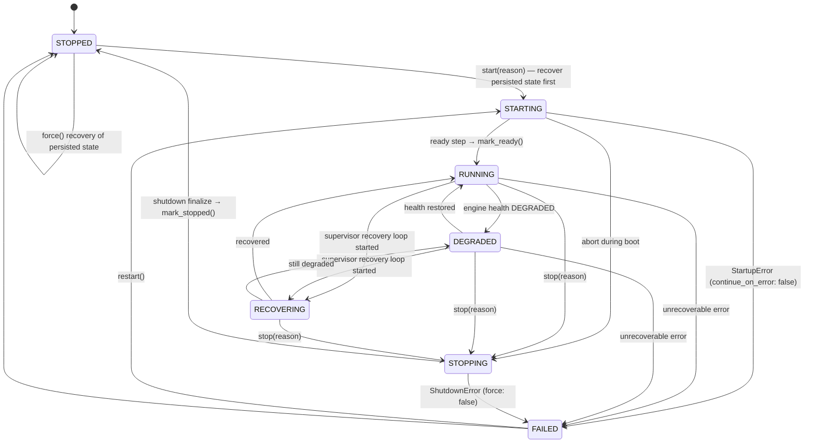
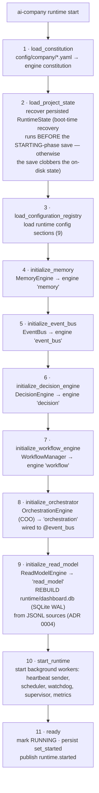
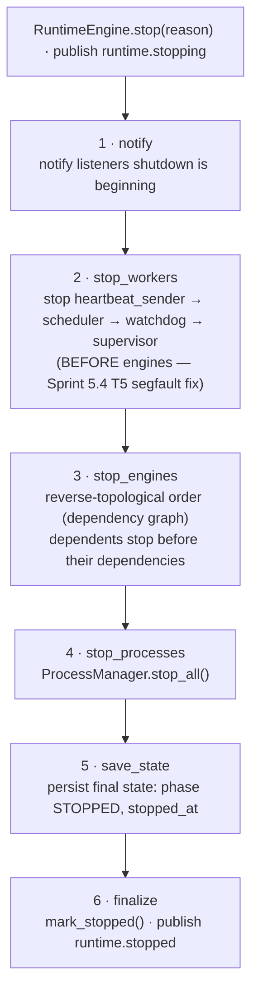

# Runtime Boot / Shutdown Lifecycle Diagram

Source of truth: `src/ai_company/runtime/lifecycle.py` (phase machine),
`config/runtime/startup.yaml` (11 boot steps), `src/ai_company/runtime/startup.py`,
`src/ai_company/runtime/shutdown.py` (6 stop steps, dependency-safe reverse order).

## Phase State Machine

`RuntimeLifecycle` validates every transition; illegal ones raise
`InvalidRuntimeTransitionError`. `force()` bypasses validation (used when
recovering persisted state). Source: `RUNTIME_TRANSITIONS` in `lifecycle.py`.

`restart(reason)` = `stop()` then `start()`; publishes `runtime.restarted`.

## Boot Sequence (11 steps)

Declared in `config/runtime/startup.yaml`; executed by `StartupExecutor.run()`.
Steps whose engine is already registered are **reused**, not re-created.

Failure handling: `continue_on_error: false` (default) — first failed step raises
`StartupError`, runtime transitions to `failed`, publishes
`runtime.component_failed`. With `continue_on_error: true` remaining steps run
and the sequence is marked failed but the engine stays inspectable.

## Shutdown Sequence (6 steps)

Executed by `ShutdownExecutor` in dependency-safe order. **Critical ordering
constraint (Sprint 5.4 T5 fix):** workers stop *before* engines, so no
monitoring thread probes a component mid-teardown (previously the supervisor /
health monitor probed the read-model engine's closed SQLite connection and
segfaulted).

With `force: true` a failed step does not abort the sequence; the final
`ShutdownSequence.success` reflects whether every step completed.

## Worker Set

| Worker | Responsibility |
|---|---|
| `heartbeat_sender` | 5s heartbeats; drives liveness of registered engines |
| `watchdog` | Stale-deadline enforcement → routes failures to the supervisor |
| `scheduler` | One-time / recurring / cron job dispatch (e.g. retention 3600s, memory consolidation) |
| `supervisor` | Recovery loop: restart-before-isolate (ADR 0007); publishes `runtime.engine_isolated` / `runtime.engine_unisolated` + open/resolved alerts |
| `metrics` | 30s persistence ticker → `runtime/metrics_history.jsonl` + read-model sync (single writer) |

## References

- `docs/STARTUP_SEQUENCE.md` — step tables, parameter markers, failure handling
- `docs/RUNTIME_LIFECYCLE.md` — persisted `RuntimeState`, engine lifecycle, status snapshot
- `docs/RECOVERY.md` — supervisor / recovery / isolate semantics
- `src/ai_company/runtime/shutdown.py` — shutdown step implementations
