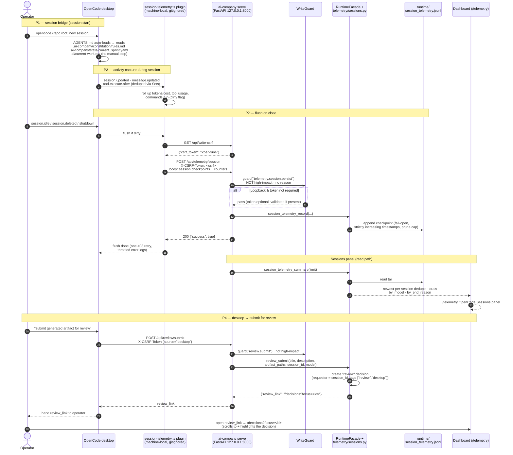

# Session Bridge & Telemetry-on-Close Sequence

Sprint 5.5 P1–P4: every OpenCode desktop session loads the constitution/sprint
state on open (P1), reports activity to the dashboard on close (P2), can be
opened from the dashboard ("continue in OpenCode", P3), and can submit a
generated artifact for review (P4). Everything is fail-open — an abrupt close
loses at most the in-flight checkpoint.

## D5 contribution (P5)

The action share numerator counts `gui` (guarded dashboard writes),
`desktop` (explicit records such as `review.submit`), and the OpenCode
**session activity** — commands run + tool calls at the newest checkpoint per
session (`telemetry/actions.py::_desktop_session_actions`). The
`telemetry.session.persist` plumbing call is **excluded** (`source=None`), so
infrastructure writes never inflate the metric.

## References

- `AGENTS.md` §"Session bridge (P1)" and §"Submit for review (Sprint 5.5 P4)"
- `.opencode/plugins/session-telemetry.ts` (machine-local, gitignored)
- `src/ai_company/telemetry/sessions.py` — server-side source of truth
- `src/ai_company/api/operational_endpoints.py` — `POST /api/telemetry/session`
  and `POST /api/review/submit`
- `src/ai_company/telemetry/actions.py` — `action_share_summary()` D5 math
