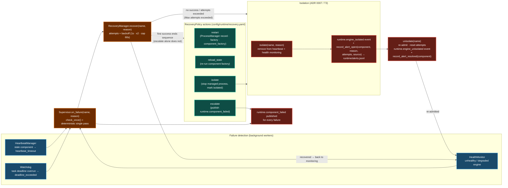
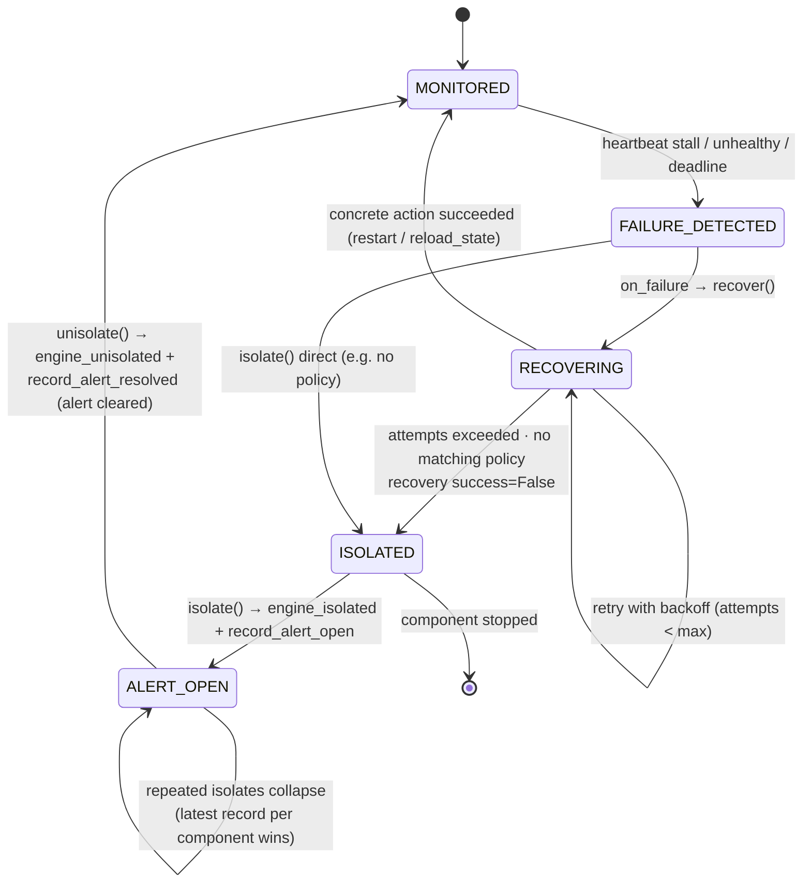

# Supervisor Self-Healing State Machine

The supervisor owns the runtime failure-detection and recovery loop:
**restart before isolate** (ADR 0007). Heartbeats/staleness, health checks,
and watchdog deadlines funnel into `Supervisor.on_failure`, recovery policies
decide the action sequence, and isolation produces operator-visible alerts
(Sprint 5.4 T3) that resolve on re-admission.

## Supervisor component state machine

A component is a registered engine or managed process. Policies match exact
name first, then trailing-`*` wildcard; a policy without `max_attempts`
inherits `default_max_attempts` (engine 3, process 2).

## Alert lifecycle (no-spam contract)

`telemetry/alerts.py::alerts_summary` derives the open-alert set from
`runtime/alerts.jsonl` — the **latest record per component wins**. A component
is open only while its most recent record is `open`; recovery or un-isolation
writes a `resolved` record that supersedes it, so one isolated component yields
exactly one open alert until resolved. Corrupt/missing lines are skipped;
every write is fail-open.

## References

- `docs/SUPERVISOR.md` — failure pipeline, policies, isolation, watchdog
- `docs/RECOVERY.md` — recovery strategies and semantics
- `docs/adr/0007-supervisor-self-healing-restart-before-isolate.md`
- `src/ai_company/runtime/` — `supervisor.py`, `recovery.py`, `watchdog.py`,
  `heartbeat.py`
- `src/ai_company/telemetry/alerts.py` — alert log + summary
- `config/runtime/recovery.yaml`, `heartbeat.yaml`, `monitoring.yaml`
