# Telemetry Data-Flow Diagram

**Architecture:** the JSONL files are the **append-only source of truth**;
SQLite (`runtime/dashboard.db`) is a **derived, rebuildable projection** for
dashboard reads (ADR 0004). Every write is fail-open — telemetry never breaks
the producer's path. Producers append from many places; reads either hit the
projection or the log directly depending on the surface.

```mermaid
flowchart TB
    subgraph PROD["Producers (append-only, fail-open)"]
        P_METRICS["Runtime metrics 30s ticker<br/>(facade.metrics_persist) + metrics_trend"]
        P_PROVIDER["UsageTrackingProvider<br/>BaseProvider.chat/complete/embed → usage"]
        P_CLI["CLI every invocation<br/>(ctx.call_on_close, baseline)"]
        P_EVENTS["EventBus + Audit<br/>events/store.jsonl (runtime.* pipeline.* task.* audit.*)"]
        P_SESSIONS["OpenCode desktop plugin<br/>POST /api/telemetry/session (guarded, P2)"]
        P_ACTIONS["WriteGuard.audited()<br/>record_action(source, action) — P5 D5 numerator"]
        P_ALERTS["Supervisor.isolate / unisolate<br/>record_alert_open / record_alert_resolved (T3)"]
        P_RUNS["GenerateRunner<br/>opencode primary → ollama fallback (R4)"]
    end

    subgraph LOGS["JSONL sources of truth (runtime/ + events/)"]
        L_METRICS["metrics_history.jsonl (7d, rollup)"]
        L_PROVIDER["provider_usage.jsonl (90d, rollup)"]
        L_CLI["cli_telemetry.jsonl (180d, rollup)"]
        L_EVENTS["events/store.jsonl"]
        L_SESSIONS["session_telemetry.jsonl (180d, no rollup)"]
        L_ACTIONS["action_telemetry.jsonl (180d, no rollup)"]
        L_ALERTS["alerts.jsonl"]
        L_RUNS["generate_runs.jsonl"]
    end

    subgraph CONSUM["Consumers"]
        subgraph RM["Read model (ADR 0004)"]
            SYNC["sync_from_jsonl() — watermark sync<br/>one transaction · idempotent · events dedup by event_id<br/>missing/truncated stream → full re-import"]
            DB["runtime/dashboard.db (SQLite WAL)<br/>schema v1: meta · events · metrics_history<br/>provider_usage"]
        end
        RETENTION["telemetry_retention job (3600s)<br/>rollup-then-truncate → rollup_*.jsonl<br/>corrupt timestamps never truncated"]
        D5["action_share_summary(window_days=30, target=80%)<br/>numerator = gui + desktop + session actions<br/>÷ (numerator + cli baseline)"]
        PANEL_SESSIONS["session_telemetry_summary()<br/>newest checkpoint per session"]
        PANEL_ALERTS["alerts_summary()<br/>latest record per component wins (no-spam)"]
    end

    subgraph API_VIEWS["Dashboard surfaces"]
        V_TELE["/telemetry — KPI · Model Usage · Agent Health<br/>· D5 card · OpenCode Sessions panel"]
        V_EVENTS["/health · /pulse · /events — event log"]
        V_ALERTS["System Health isolation-alerts card + chips"]
        V_RUNS["/generate — runs & history"]
    end

    %% Producers → logs
    P_METRICS --> L_METRICS
    P_PROVIDER --> L_PROVIDER
    P_CLI --> L_CLI
    P_EVENTS --> L_EVENTS
    P_SESSIONS --> L_SESSIONS
    P_ACTIONS --> L_ACTIONS
    P_ALERTS --> L_ALERTS
    P_RUNS --> L_RUNS

    %% Logs → read model (3 of the sources are projected)
    L_EVENTS --> SYNC
    L_METRICS --> SYNC
    L_PROVIDER --> SYNC
    SYNC --> DB

    %% Logs → other consumers
    L_METRICS --> RETENTION
    L_PROVIDER --> RETENTION
    L_CLI --> RETENTION
    RETENTION -->|rollup aggregates| L_METRICS
    RETENTION -->|rollup aggregates| L_PROVIDER
    RETENTION -->|rollup aggregates| L_CLI

    L_ACTIONS --> D5
    L_SESSIONS --> D5
    L_CLI --> D5
    L_SESSIONS --> PANEL_SESSIONS
    L_ALERTS --> PANEL_ALERTS

    %% Consumers → API/views (facade fail-open: store first, JSONL fallback)
    DB -->|"facade.metrics_history_summary /<br/>provider_usage_summary (store-first, JSONL fallback)"| V_TELE
    L_METRICS -.->|"JSONL fallback"| V_TELE
    L_PROVIDER -.->|"JSONL fallback"| V_TELE
    DB -->|"recent_events / event_counts_by_type"| V_EVENTS
    PANEL_ALERTS --> V_ALERTS
    D5 --> V_TELE
    PANEL_SESSIONS --> V_TELE
    L_RUNS --> V_RUNS

    classDef prod fill:#1a4a6a,stroke:#3498db,stroke-width:2px,color:#fff
    classDef log fill:#0e4d45,stroke:#1abc9c,stroke-width:2px,color:#fff
    classDef cons fill:#5b2c6f,stroke:#9b59b6,stroke-width:2px,color:#fff
    classDef view fill:#17202a,stroke:#7f8c8d,stroke-width:2px,color:#fff

    class P_METRICS,P_PROVIDER,P_CLI,P_EVENTS,P_SESSIONS,P_ACTIONS,P_ALERTS,P_RUNS prod
    class L_METRICS,L_PROVIDER,L_CLI,L_EVENTS,L_SESSIONS,L_ACTIONS,L_ALERTS,L_RUNS log
    class SYNC,DB,RETENTION,D5,PANEL_SESSIONS,PANEL_ALERTS cons
    class V_TELE,V_EVENTS,V_ALERTS,V_RUNS view
```

## Notes

- **Read model projection scope:** only `events`, `metrics_history`, and
  `provider_usage` are synced into SQLite (session/action/cli telemetry are
  read straight from JSONL — the readmodel sync keys are
  metrics/provider/cli only). Session/action logs are per-record (rollup
  `false`), so they stay JSONL-only.
- **D5 share (P5):** numerator = GUI guarded writes + desktop records
  (`review.submit`) + OpenCode session commands/tool calls at the **newest
  checkpoint per session** (same dedupe as the Sessions panel); denominator =
  numerator + the signed-off CLI baseline (`cli_telemetry.jsonl`). Missing or
  corrupt logs contribute zero.
- **Retention (T2):** `rollup-then-truncate` — expired raw records are folded
  into hourly/daily rollup rows *before* the raw log is truncated; a bucket
  already in the rollup file is skipped (idempotent).
- **No-spam alerts (T3):** the summary collapses repeated isolates per
  component to one open alert until a `resolved` record supersedes it.

## References

- `src/ai_company/telemetry/` — `metrics.py`, `provider.py`, `cli.py`,
  `sessions.py`, `actions.py`, `alerts.py`, `retention.py`
- `src/ai_company/readmodel/` — `store.py`, `engine.py`
- `config/runtime/telemetry.yaml` — retention policies
