# Dashboard View → Endpoint → Facade Map

Every dashboard view is a thin Jinja2 adapter (ADR 0003 — services layer is the
single surface). A view renders the same facade data the JSON API exposes;
neither the HTML pages nor the JSON endpoints ever call engines directly. The
frozen CLI reads go through the identical facade methods, so the parity matrix
(R3) can compare CLI output == API JSON == what the view renders.

```mermaid
flowchart TB
    subgraph VIEWS["Jinja2 views (api/templates/views/)"]
        V_PULSE["/ (pulse)"]
        V_HEALTH["/health"]
        V_AGENTS["/agents"]
        V_RUNS["/runs"]
        V_MEMORY["/memory"]
        V_WRITES["/writes"]
        V_GEN["/generate"]
        V_DEC["/decisions"]
        V_TEL["/telemetry"]
        V_REP["/reports"]
        V_VAL["/validation"]
        V_REG["/registry"]
    end

    subgraph API["JSON API + WS (api/)"]
        A_HEALTH["GET /api/health · status · metrics · engines<br/>GET /api/diagnostics · /api/events"]
        A_REG["GET /api/registry · /registry/verify · /registry/{name}<br/>GET /api/executives · /executives/{name} · /org-chart<br/>GET /api/graph · /graph/stats"]
        A_MEM["GET /api/memory · /memory/search · /memory/stats<br/>GET /api/memory/snapshots · /memory/{key}"]
        A_ORCH["GET /api/orchestrate/status · /orchestrate/history"]
        A_GEN["GET /api/generate/targets · /generate/runs<br/>GET /generate/runs/{id} · /generate/runs/{id}/log"]
        A_DEC["GET /api/decisions · /decisions/{id}<br/>GET /api/company · /api/validate/{artifact}"]
        A_TEL["GET /api/telemetry/metrics · /providers · /sessions<br/>GET /api/telemetry/actions · /api/alerts · /api/backup"]
        A_REP["GET /api/reports · /reports/{type} · /api/validate"]
        A_WS["WS /api/ws (replay ?since= then live feed)"]
        A_WRITE["POST /api/runtime/* · /orchestrate/* · /memory/*<br/>POST /api/generate · /decisions/* · /review/submit<br/>POST /api/company/* · /agents/sync · /backup<br/>POST /api/telemetry/* · /validate · /reports/generate<br/>GET /api/write-csrf · /api/audit/writes"]
    end

    subgraph FACADE["RuntimeFacade (services/runtime_facade.py)"]
        F_RUNTIME["status · health · health_summary · metrics<br/>engine_states · diagnostics · metrics_persist"]
        F_REG["registry_list/show/verify · executives_list/show<br/>org_chart · graph_show/stats"]
        F_MEM["memory_list/get/search/stats/snapshots<br/>memory_save/update/archive/unarchive/snapshot/restore/export"]
        F_ORCH["orchestration_status/history<br/>orchestrate_plan/start/resume/retry/rollback"]
        F_GEN["generate_targets · generate_runs · generate_run<br/>generate_start · generate_cancel · generate_log"]
        F_DEC["decisions_list/get/create/approve/reject/escalate/cancel<br/>review_submit · validate_artifacts"]
        F_TEL["metrics_history_summary · provider_usage_summary<br/>session_telemetry_summary · action_telemetry_summary<br/>alerts_summary · retention_status · backup_status"]
        F_VAL["validate_read/run · report_generate_read/write<br/>reports_list · build_run · bootstrap_run"]
    end

    subgraph ENGINES["Engines & stores (runtime/)"]
        RT["RuntimeEngine (lifecycle · config · workers)"]
        REG_E["RegistryEngine / ValidatorEngine"]
        MEM_E["MemoryEngine"]
        ORCH_E["OrchestrationEngine (COO pipelines)"]
        GEN_E["GenerateRunner + generate_dispatch"]
        DEC_E["DecisionEngine + DecisionHistory"]
        EV_E["EventBus + read model (SQLite WAL)<br/>telemetry JSONL sources"]
    end

    V_PULSE --> A_HEALTH & A_TEL
    V_HEALTH --> A_HEALTH
    V_AGENTS --> A_REG
    V_RUNS --> A_ORCH
    V_MEMORY --> A_MEM
    V_WRITES --> A_WRITE
    V_GEN --> A_GEN
    V_DEC --> A_DEC
    V_TEL --> A_TEL
    V_REP --> A_REP
    V_VAL --> A_REP
    V_REG --> A_REG

    A_HEALTH --> F_RUNTIME
    A_REG --> F_REG
    A_MEM --> F_MEM
    A_ORCH --> F_ORCH
    A_GEN --> F_GEN
    A_DEC --> F_DEC
    A_TEL --> F_TEL
    A_REP --> F_VAL
    A_WS --> EV_E
    A_WRITE --> F_RUNTIME & F_MEM & F_ORCH & F_GEN & F_DEC & F_TEL & F_VAL

    F_RUNTIME --> RT
    F_REG --> REG_E
    F_MEM --> MEM_E
    F_ORCH --> ORCH_E
    F_GEN --> GEN_E
    F_DEC --> DEC_E
    F_TEL --> EV_E
    F_VAL --> REG_E & EV_E

    classDef view fill:#17202a,stroke:#7f8c8d,stroke-width:2px,color:#fff
    classDef api fill:#1a4a6a,stroke:#3498db,stroke-width:2px,color:#fff
    classDef facade fill:#6e2c00,stroke:#e67e22,stroke-width:2px,color:#fff
    classDef eng fill:#0e4d45,stroke:#1abc9c,stroke-width:2px,color:#fff

    class V_PULSE,V_HEALTH,V_AGENTS,V_RUNS,V_MEMORY,V_WRITES,V_GEN,V_DEC,V_TEL,V_REP,V_VAL,V_REG view
    class A_HEALTH,A_REG,A_MEM,A_ORCH,A_GEN,A_DEC,A_TEL,A_REP,A_WS,A_WRITE api
    class F_RUNTIME,F_REG,F_MEM,F_ORCH,F_GEN,F_DEC,F_TEL,F_VAL facade
    class RT,REG_E,MEM_E,ORCH_E,GEN_E,DEC_E,EV_E eng
```

## View → endpoint ledger

| View | Route | Endpoints feeding it | Facade methods | Engine / store |
|---|---|---|---|---|
| pulse | `/` | `/api/health`, `/api/status`, `/api/engines`, `/api/metrics`, `/api/memory/stats`, `/api/backup`, `/api/alerts` | `health`, `health_summary`, `status`, `engine_states`, `memory_stats`, `backup_status`, `alerts_summary` | RuntimeEngine, MemoryEngine, telemetry |
| health | `/health` | `/api/health`, `/api/status`, `/api/engines`, `/api/diagnostics`, `/api/alerts` | `health`, `status`, `engine_states`, `diagnostics`, `alerts_summary` | RuntimeEngine |
| agents | `/agents` | `/api/executives`, `/api/org-chart` | `executives_list`, `org_chart` | RegistryEngine |
| runs | `/runs` | `/api/orchestrate/status`, `/api/orchestrate/history` | `orchestration_status`, `orchestration_history` | OrchestrationEngine |
| memory | `/memory` | `/api/memory/stats`, `/api/memory` | `memory_stats`, `memory_list` | MemoryEngine |
| writes | `/writes` | `GET /api/audit/writes`, `GET /api/write-csrf` | (auth + audit read) | WriteGuard / audit JSONL |
| generate | `/generate` | `/api/generate/targets`, `/api/generate/runs` | `generate_targets`, `generate_runs` | GenerateRunner + command map |
| decisions | `/decisions` | `/api/decisions`, `/api/decisions/{id}` | `decisions_list`, `decisions_get` | DecisionEngine |
| telemetry | `/telemetry` | `/api/telemetry/metrics`, `/providers`, `/sessions`, `/actions`, `/api/alerts`, `/api/telemetry/retention` | `metrics_history_summary`, `provider_usage_summary`, `session_telemetry_summary`, `action_telemetry_summary`, `alerts_summary`, `retention_status` | read model (SQLite) + telemetry JSONL |
| reports | `/reports` | `/api/reports`, `/api/reports/{type}`, `/api/validate` | `reports_list`, `report_generate_read`, `validate_read` | ValidatorEngine |
| validation | `/validation` | `/api/validate` | `validate_read` | ValidatorEngine |
| registry | `/registry` | `/api/registry`, `/api/graph/stats`, `/api/org-chart` | `registry_list`, `graph_stats`, `org_chart` | RegistryEngine |

Write mutations (the `POST`/`PATCH`/`DELETE` surface, ADR 0010) are guarded by
`WriteGuard` (bearer token → CSRF → high-impact `reason` → audit) before any
facade write method runs; the write-auth flow is documented in
`write-auth-flow-diagram.md`.

## References

- `src/ai_company/api/app.py` — view + read-endpoint definitions (ADR 0002/0009)
- `src/ai_company/api/write_endpoints.py`, `api/operational_endpoints.py` — guarded write surface
- `src/ai_company/services/runtime_facade.py` — the single shared surface (ADR 0003)
- `src/ai_company/api/templates/views/` — the 12 Jinja2 views
- `docs/dashboard/parity-matrix-v0.md` — R3 CLI == API == view parity rows
